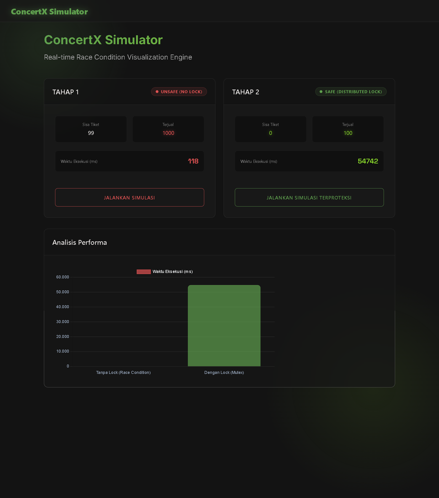
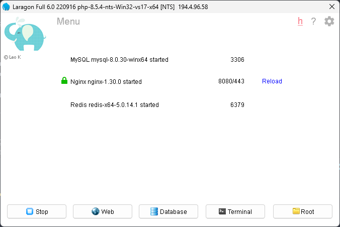
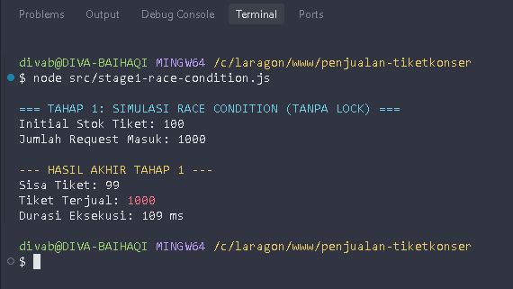
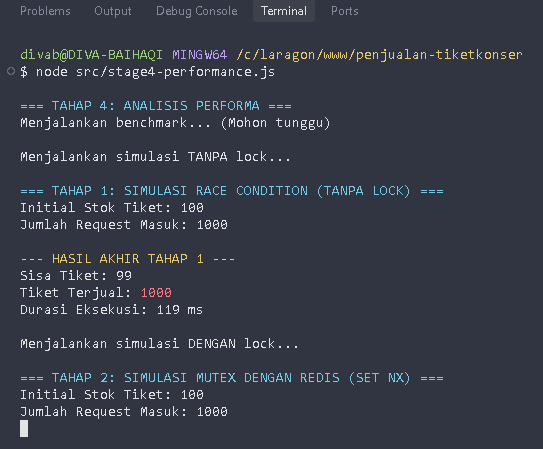

# ConcertX Simulator: Race Condition & Distributed Mutex Solution



## 📌 Overview

**ConcertX Simulator** adalah platform simulasi teknis untuk mendemonstrasikan fenomena **Race Condition** pada sistem penjualan tiket konser *high-concurrency* dan menyelesaikannya menggunakan **Distributed Mutex** berbasis **Redis**. 

Proyek ini mensimulasikan skenario "War Tiket" di mana ribuan pengguna mencoba membeli stok tiket yang sama di milidetik yang sama. Tanpa proteksi, hal ini mengakibatkan *overbooking*. Proyek ini menunjukkan implementasi penguncian terdistribusi yang menjamin integritas data 100%.

## 🚀 Key Features

- **High-Concurrency Simulation**: Menembakkan 1.000+ request simultan ke endpoint transaksi.
- **Data Integrity Guarantee**: Memastikan stok tidak pernah negatif menggunakan Redis SET NX.
- **Interactive Visualization**: Dashboard modern dengan tema Glassmorphism dan Chart.js.
- **Detailed Benchmarking**: Perbandingan performa antara sistem tanpa lock vs sistem dengan lock.

## 🛠 Tech Stack & Environment

| Component | Technology |
| :--- | :--- |
| **Runtime** | Node.js (V25+) |
| **Backend Framework** | Express.js |
| **In-Memory Store** | Redis (Distributed Lock) |
| **Local Environment** | Laragon Full (Redis 5.0.14) |
| **UI Styling** | Tailwind CSS & Glassmorphism Design |


*Tampilan environment Redis yang aktif pada panel Laragon.*

## 📁 Project Structure

```text
penjualan-tiketkonser/
├── src/
│   ├── stage1-race-condition.js  # Simulasi Race Condition
│   ├── stage2-mutex-redis.js     # Solusi Mutex dengan Redis
│   ├── stage3-verification.js    # Verifikasi Integritas Data
│   └── stage4-performance.js     # Analisis Performa & Benchmark
├── web/                          # Web Dashboard (Express + Frontend)
├── laporan/                      # Laporan Analisis Teknis (Markdown)
└── screenshot/                   # Galeri Hasil Simulasi
```

## 🔍 Technical Demonstrations

### 1. Race Condition (Unsafe Mode)
Tanpa mekanisme penguncian, sistem mengalami inkonsistensi data parah di mana tiket terjual melebihi stok yang tersedia.


*Output terminal menunjukkan sisa tiket yang menjadi negatif (Overbooked).*

### 2. Performance Analysis & Consistency
Menggunakan Redis sebagai Distributed Mutex memastikan setiap transaksi diproses secara linear dan aman.


*Tabel perbandingan performa menunjukkan trade-off antara kecepatan dan keamanan data.*

## ⚙️ Installation & Usage

1. **Install Dependencies**:
   ```bash
   npm install
   ```
2. **Jalankan Web Dashboard**:
   ```bash
   node web/server.js
   ```
   Akses di `http://localhost:3000`
3. **Jalankan Benchmark CLI**:
   ```bash
   node src/stage4-performance.js
   ```

## 👤 Author

- **Nama**: Diva Baihaqi
- **NIM**: 230511044
- **Kelas**: TI23B
- **Mata Kuliah**: Sistem Paralel dan Terdistribusi
- **Dosen Pengampu**: Bapak Samudra Prasetio
- **Universitas**: Universitas Muhammadiyah Cirebon

---
© 2026 Diva Baihaqi. Engineering with Integrity.
